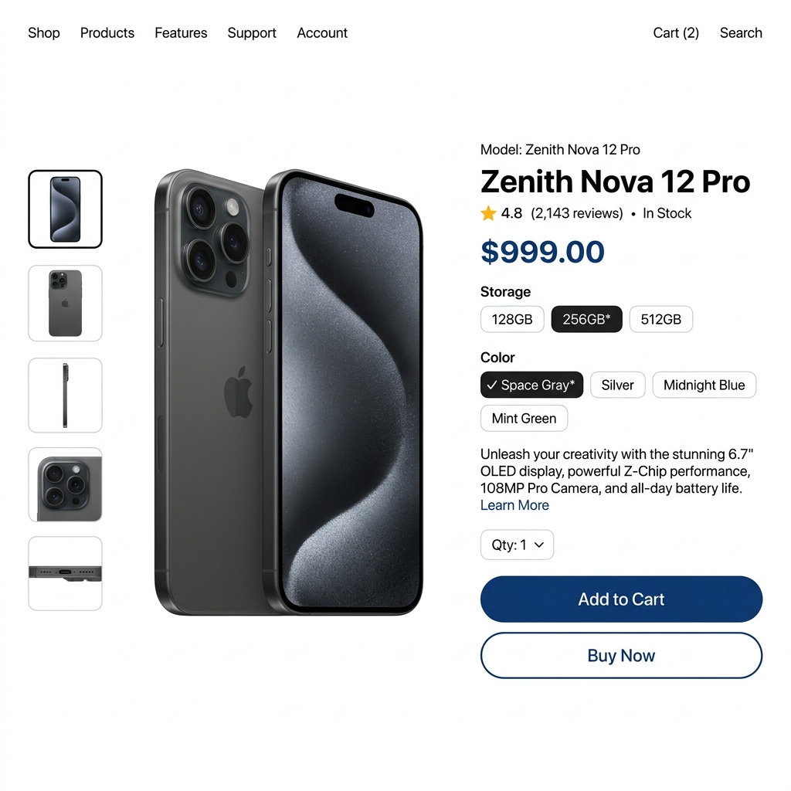
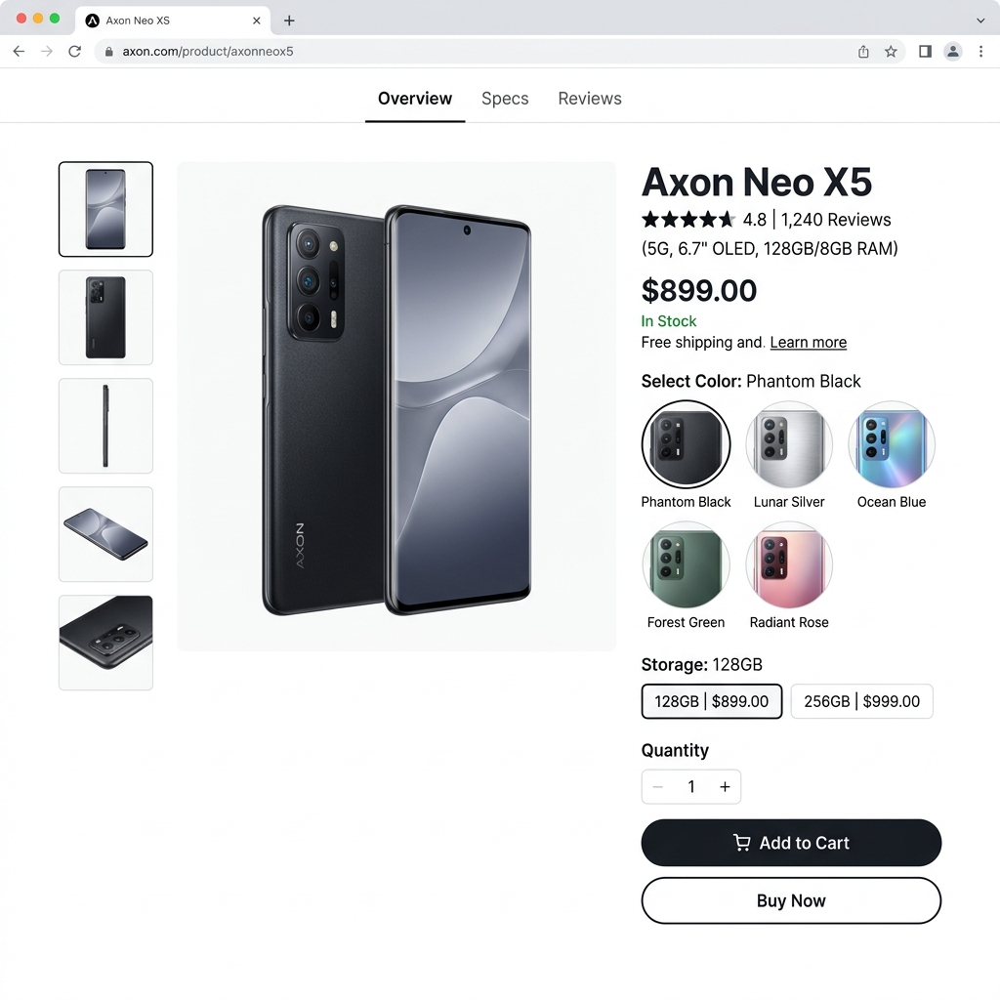
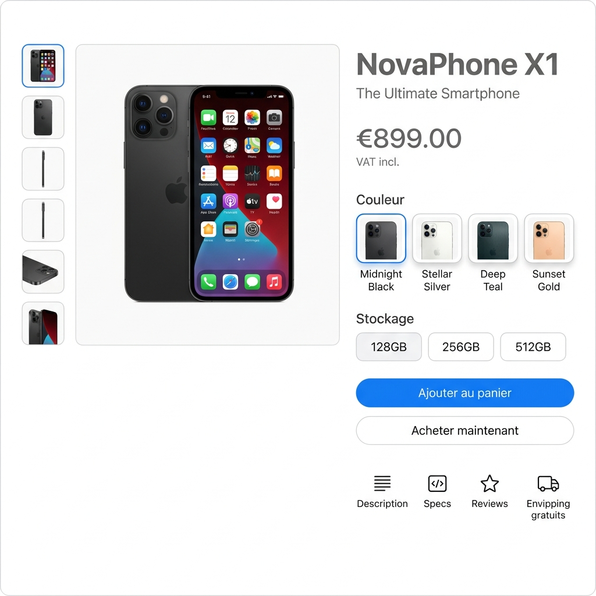

# Sansgato 🛒

[](https://github.com/USERNAME/sansgato/actions/workflows/flutter_ci.yml)
[](CHANGELOG.md)

Une application mobile de commerce électronique complète avec back-office intégré, développée en Flutter pour le frontend et Django pour le backend.

## 📱 Fonctionnalités Principales

*   **Catalogue en ligne :** Parcourez nos produits, variantes et promotions.
*   **Panier & Paiement :** Intégration de Wave, Orange Money et Moov.
*   **Géolocalisation :** Suivi et définition de l'adresse de livraison via Google Maps.
*   **Authentification Sécurisée :** Connexion classique, Google Sign-In, et par numéro de téléphone avec vérification OTP (Twilio).
*   **Espace Admin Intégré :** Gestion des stocks, création de produits avec images, et suivi des commandes directement depuis l'application mobile.

## 🏗️ Architecture Technique

Ce projet est divisé en deux parties principales :

1.  **Frontend (Flutter) :**
    *   **Gestion d'état :** Riverpod (`flutter_riverpod`)
    *   **Architecture :** MVVM / Service Pattern (Dossiers séparés pour les Modèles, Vues/Screens, Providers et Services API).
    *   **Réseau :** Dio et http pour les communications REST.
2.  **Backend (Python / Django) :**
    *   **API :** Django REST Framework.
    *   **Base de données :** SQLite (Développement).
    *   **Authentification :** JWT et authentification tierce.

## 🚀 Guide d'installation (Setup)

### Prérequis
*   Flutter SDK (v3.10 ou supérieure)
*   Python (v3.10 ou supérieure)
*   Une clé API Google Maps valide

### Lancer le Backend (Django)
```bash
cd backend
python -m venv .venv
source .venv/bin/activate  # ou .venv\Scripts\activate sous Windows
pip install -r requirements.txt
python manage.py migrate
python manage.py runserver
```

### Lancer l'Application Mobile (Flutter)
```bash
cd sansgato
flutter pub get
flutter run
```

## 📸 Captures d'écran

*(Remplacez ces liens par vos vraies captures d'écran dans le dossier assets/screenshots)*

<div style="display: flex; gap: 10px;">
  
  
  
</div>

---
*Projet développé dans le cadre d'une certification.*
